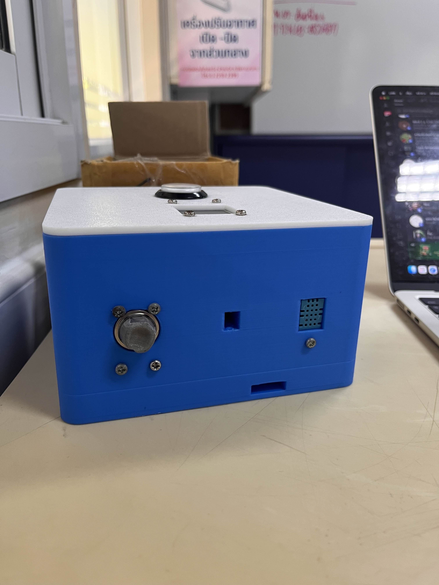
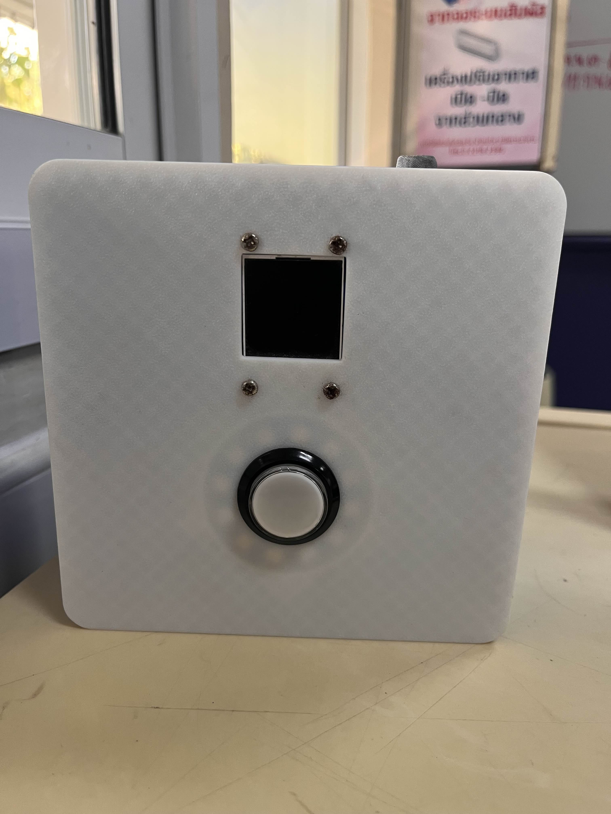

# Weather-box
````md
# Weather-box
Smart Weather & Air Quality Monitoring System (ESP32)

Weather-box คืออุปกรณ์ตรวจวัดสภาพแวดล้อมอัจฉริยะ พัฒนาบน ESP32  
สามารถตรวจวัดอุณหภูมิ ความชื้น คุณภาพอากาศ และแก๊สอันตราย  
แสดงผลบนหน้าจอสี และส่งข้อมูลขึ้น Cloud ผ่าน HTTPS อย่างปลอดภัย


---

## Features
- วัดอุณหภูมิและความชื้นด้วย DHT11
- ตรวจวัดฝุ่น PM1.0 / PM2.5 / PM10 ด้วย PMS Sensor
- ตรวจจับแก๊สอันตราย
- แสดงผลด้วยจอ TFT LCD (ST7735)
- แสดงสถานะด้วย NeoPixel RGB LED
- ปุ่มกดสำหรับสลับโหมดการแสดงผล
- ตั้งค่า Wi-Fi ผ่าน Access Point และ Web Configuration
- ส่งข้อมูลไปยัง Web API ด้วย HTTPS (Secure POST)
- ใช้ FreeRTOS สำหรับ Multitasking

---

## System Overview
ESP32 ทำหน้าที่เป็นศูนย์กลางของระบบ  
อ่านค่าจากเซนเซอร์ต่าง ๆ และแสดงผลแบบเรียลไทม์บนหน้าจอ TFT  
ข้อมูลจะถูกส่งไปยังเซิร์ฟเวอร์ผ่าน HTTPS เพื่อใช้ในการแสดงผลหรือวิเคราะห์ข้อมูลต่อไป

ระบบถูกออกแบบให้ทำงานแบบ Multitasking โดยใช้ FreeRTOS  
เพื่อให้การแสดงผลและการสื่อสารเครือข่ายทำงานพร้อมกันได้อย่างเสถียร

---

## Display Modes
| Mode | Description |
|------|------------|
| 0 | หน้าจอเริ่มต้น (Standby) |
| 1 | แสดงอุณหภูมิ |
| 2 | แสดงความชื้น |
| 3 | แสดงค่าฝุ่น PM1.0 / PM2.5 / PM10 |
| 4 | แสดงค่าการตรวจจับแก๊สอันตราย |

ผู้ใช้สามารถกดปุ่มเพื่อสลับโหมดการแสดงผล

---

## Wi-Fi Configuration
- เมื่อเปิดเครื่อง ESP32 จะสร้าง Wi-Fi Access Point
- ผู้ใช้เชื่อมต่อผ่านมือถือหรือคอมพิวเตอร์
- เข้าเว็บเพื่อตั้งค่า SSID และ Password
- ข้อมูลถูกบันทึกลง Flash Memory (Preferences)
- รีสตาร์ทแล้วเชื่อมต่อ Wi-Fi อัตโนมัติ

---

## Cloud Communication
ระบบส่งข้อมูลไปยัง Web Server ด้วย HTTPS เพื่อความปลอดภัย

ตัวอย่างข้อมูล JSON ที่ส่ง:
```json
{
  "temp": 30.5,
  "humidity": 65,
  "Pm": [12, 25, 40],
  "Danger gas": true,
  "Air pressure": 0,
  "position": [0, 0],
  "stationID": 0
}
````

---

## Multitasking (FreeRTOS)

ระบบใช้ FreeRTOS แยกการทำงานออกเป็นหลายส่วน:

* Task สำหรับอ่านค่าอุณหภูมิและความชื้น
* Task สำหรับส่งข้อมูลไปยัง Server
* Loop หลักสำหรับการแสดงผลและการโต้ตอบกับผู้ใช้

ช่วยให้ระบบทำงานได้ต่อเนื่องและเสถียร

---

## Hardware Used

* ESP32
* DHT11 Temperature & Humidity Sensor
* PMS Dust Sensor
* Gas Sensor
* TFT LCD ST7735
* NeoPixel RGB LED (12 LEDs)
* Push Button

---

## Project Structure

```
Weather-box/
├── weather_box_V1.0.ino
├── README.md
├── 1.jpg
└── 2.jpg
```

---

## How to Use

1. อัปโหลดไฟล์ `weather_box_V1.0.ino` ลง ESP32
2. เปิดเครื่องและเชื่อมต่อ Wi-Fi Access Point
3. ตั้งค่า Wi-Fi ผ่านหน้าเว็บ
4. กดปุ่มเพื่อเปลี่ยนโหมดการแสดงผล
5. ตรวจสอบข้อมูลที่ส่งไปยัง Server

---

## Use Cases
## Project Preview
<p align="center">
  
  
</p>


* สถานีตรวจวัดสภาพอากาศขนาดเล็ก
* ระบบ Smart Home และ Smart City
* โปรเจกต์ IoT ด้านสิ่งแวดล้อม


```
